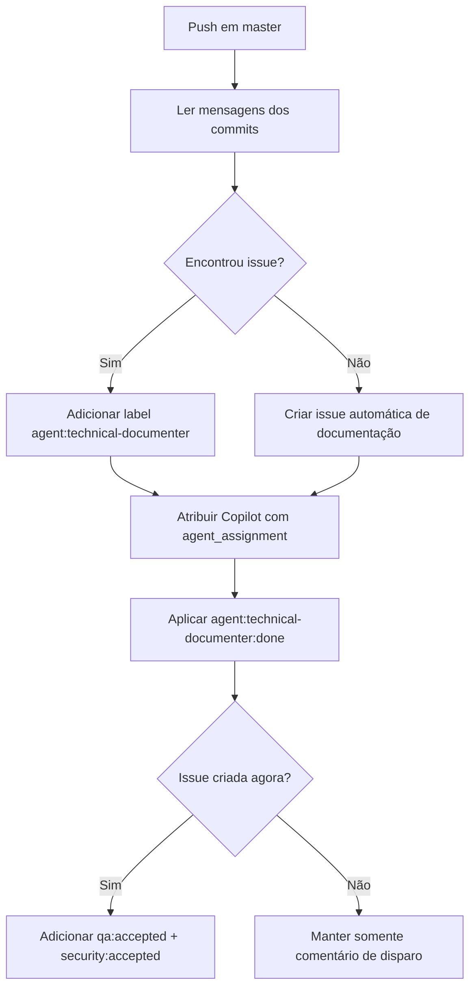

# Automação — technical-documenter após push em `master`

Documentação técnica da entrega associada a `ControleOnline/ui-orders#13` e ao commit `958465e64744993527f038e2184a70591a4371a7`.

> Cópia operacional no repositório (`docs/technical/`). A wiki do módulo (`ui-orders/wiki`) é a fonte primária de leitura.

## Objetivo

Registrar o fluxo automático que dispara a trilha de **documentação técnica** quando ocorre push em `master` no repositório `ui-orders`.

O workflow **não altera código de produto**. Ele apenas:

- detecta se os commits já referenciam uma issue;
- abre ou prepara uma issue de documentação técnica quando necessário;
- atribui a issue ao Copilot com instruções do papel `technical-documenter`;
- finaliza labels operacionais do fluxo.

## Repositórios afetados

| Módulo | Papel no fluxo |
| --- | --- |
| `ui-orders` | Repositório que recebe o push em `master` e executa o workflow |
| `agents-mcp` | Fonte canônica das instruções do papel `technical-documenter` |
| `app-community` | Referência transversal para `APP_TYPE` / modos de operação do ecossistema |

## Visão de módulo (`APP_TYPE`)

| Contexto | Papel |
| --- | --- |
| **POS / SHOP / DELIVERY / SERVICE** | `ui-orders` continua sendo o módulo de pedidos e operação de venda |
| **Fluxo operacional do repositório** | O workflow atua só em GitHub Actions / issues; não muda comportamento de tela nem contrato de runtime |

Esta automação existe no nível **operacional de repositório**. Ela não cria regra nova de negócio para checkout, caixa, catálogo ou navegação do app.

## Gatilho e arquivo responsável

- Workflow: `.github/workflows/technical-documenter.yml`
- Evento: `push`
- Branch monitorada: `master`

## Fluxo operacional

### 1. Detectar issue de origem

O job lê as mensagens entre `github.event.before` e `github.sha` e procura a primeira referência no formato:

- `#123`
- `owner/repo#123`

Se encontrar, reutiliza o número da issue existente.

### 2. Preparar ou criar issue de documentação

Quando já existe issue referenciada:

- adiciona a label `agent:technical-documenter`;
- atribui `copilot-swe-agent[bot]`;
- envia `agent_assignment` com `target_repo`, `base_branch=master` e instruções customizadas.

Quando **não** existe issue de origem:

- cria uma issue com título `docs: documentação técnica automática (push master <sha>)`;
- registra o commit e a mensagem do push no corpo;
- já cria a issue com a label `agent:technical-documenter`;
- atribui `copilot-swe-agent[bot]` com as mesmas instruções do papel.

### 3. Finalizar labels operacionais

Ao final do workflow:

- adiciona `agent:technical-documenter:done`;
- remove `agent:technical-documenter`;
- se a issue foi criada automaticamente, também adiciona `qa:accepted` e `security:accepted`;
- publica comentário explicando que a documentação técnica foi disparada via workflow.

## Contrato e limites

### O que este workflow faz

- transforma push direto em `master` sem rastreabilidade documental em uma issue processável;
- reaproveita issues já citadas nos commits quando existirem;
- centraliza as instruções do `technical-documenter` em `agents-mcp`.

### O que este workflow **não** deve fazer

- não implementa correção ou feature de produto;
- não substitui revisão funcional da entrega original;
- não muda `APP_TYPE`, rotas, telas ou contratos de API do módulo;
- não define conteúdo final da wiki por conta própria: ele só aciona a trilha de documentação.

## Fluxo resumido

## Operação e manutenção

- Se o padrão de referência de issue mudar, atualizar a expressão `grep -oE '([A-Za-z0-9_.-]+/[A-Za-z0-9_.-]+)?#([0-9]+)'`.
- Se a branch padrão do repositório mudar, atualizar `branches: [master]` e o `base_branch` enviado ao `agent_assignment`.
- Se o papel `technical-documenter` mudar de fonte canônica, atualizar apenas a URL de `CUSTOM_INSTRUCTIONS`, mantendo o wrapper curto.
- Toda mudança de labels ou comentários deste workflow deve ser refletida nesta página e na Home/Sidebar da wiki do módulo.

## Links cruzados

| Destino | URL |
| --- | --- |
| Home do módulo | https://github.com/ControleOnline/ui-orders/wiki |
| Workflow versionado | https://github.com/ControleOnline/ui-orders/blob/master/.github/workflows/technical-documenter.yml |
| Issue de documentação automática | https://github.com/ControleOnline/ui-orders/issues/13 |
| Commit de origem | https://github.com/ControleOnline/ui-orders/commit/958465e64744993527f038e2184a70591a4371a7 |
| Papel canônico `technical-documenter` | https://raw.githubusercontent.com/ControleOnline/agents-mcp/master/agents/roles/technical-documenter/agent.md |
| Wiki principal do app | https://github.com/ControleOnline/app-community/wiki |
| Visões do app (`APP_TYPE`) | https://github.com/ControleOnline/app-community/blob/master/MODOS_OPERACAO.md |
