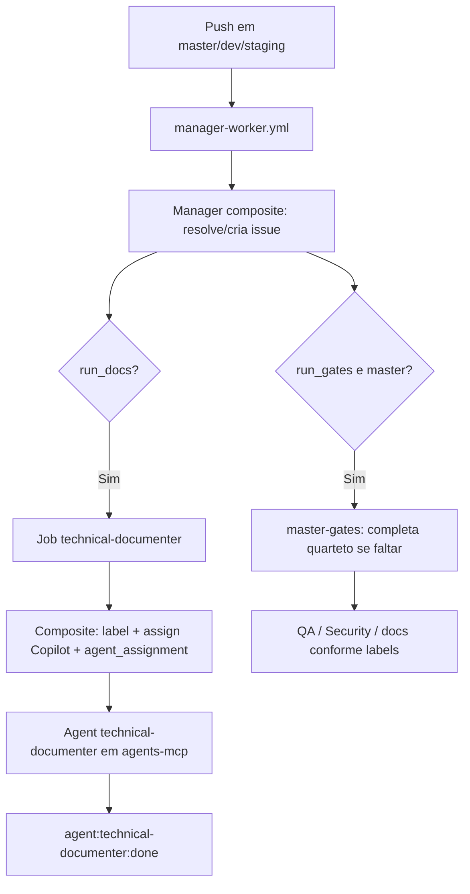

# Automação — technical-documenter via Manager Worker

Documentação técnica da trilha de documentação automática no repositório `ControleOnline/ui-orders`.

> Cópia operacional no repositório (`docs/technical/`). A wiki do módulo (`ui-orders/wiki`) é a fonte primária de leitura.

## Objetivo

Registrar o fluxo automático que dispara a trilha de **documentação técnica** quando ocorre push em `master` (e também em `dev` / `staging` conforme o plano do Manager).

A automação **não altera código de produto**. Ela apenas:

- resolve ou cria uma issue rastreável a partir dos commits;
- decide se a trilha de docs deve rodar (`run_docs`);
- atribui a issue ao Copilot com instruções do papel `technical-documenter` (fonte canônica em `agents-mcp`);
- em push para `master`, completa o quarteto de gates quando faltam labels de aceite/documentação.

## Histórico relevante

| Commit / evento | O que aconteceu |
| --- | --- |
| `958465e` | Introdução do workflow legado standalone `.github/workflows/technical-documenter.yml` |
| `e4faf08` | Remoção do workflow legado — substituído pelo orquestrador `manager-worker.yml` + composite action |
| `29b6781` | Composite action `.github/actions/workers/technical-documenter` |
| Issue `#13` | Issue automática de documentação gerada no modelo legado; já `agent:technical-documenter:done` + `qa:accepted` + `security:accepted` |

**Estado atual (fonte de verdade):** não existe mais `.github/workflows/technical-documenter.yml` em `master`. O gatilho e a orquestração estão em `manager-worker.yml`.

## Repositórios afetados

| Módulo | Papel no fluxo |
| --- | --- |
| `ui-orders` | Repositório que recebe o push e executa o Manager Worker |
| `agents-mcp` | Fonte canônica das instruções do papel `technical-documenter` |
| `app-community` | Referência transversal para `APP_TYPE` / modos de operação do ecossistema |

## Visão de módulo (`APP_TYPE`)

| Contexto | Papel |
| --- | --- |
| **POS / SHOP / DELIVERY / SERVICE** | `ui-orders` continua sendo o módulo de pedidos e operação de venda |
| **Fluxo operacional do repositório** | A automação atua só em GitHub Actions / issues; não muda comportamento de tela nem contrato de runtime |

Esta automação existe no nível **operacional de repositório**. Ela não cria regra nova de negócio para checkout, caixa, catálogo ou navegação do app.

## Gatilho e arquivos responsáveis

| Artefato | Caminho | Função |
| --- | --- | --- |
| Orquestrador | `.github/workflows/manager-worker.yml` | `on.push` em `master`, `dev`, `staging`; job `manager` resolve issue e planeja workers |
| Worker docs | job `technical-documenter` (no mesmo workflow) | Roda se `needs.manager.outputs.run_docs == 'true'` |
| Composite action | `.github/actions/workers/technical-documenter/action.yml` | Adiciona label `agent:technical-documenter`, atribui Copilot com `agent_assignment` e comenta |
| Manager composite | `.github/actions/workers/manager/action.yml` | Resolve/cria issue a partir dos commits e define `run_docs` / gates |

## Fluxo operacional (atual)

### 1. Push → Manager resolve issue

O job `manager` (composite `workers/manager`) lê o contexto do push na branch (`github.ref_name`) e:

- procura referência de issue nas mensagens de commit (`#N` ou `owner/repo#N`);
- se não houver, pode criar issue operacional conforme a política do Manager;
- exporta `issue_number`, `run_docs`, `run_qa`, `run_security`, `run_gates`, `base_branch`.

### 2. Worker technical-documenter (quando `run_docs`)

O job `technical-documenter` invoca a composite action, que:

1. adiciona a label `agent:technical-documenter` na issue;
2. atribui `copilot-swe-agent[bot]` com `agent_assignment` (`target_repo`, `base_branch`, `custom_instructions` apontando **somente** para `agents-mcp`);
3. comenta que o Manager Worker encaminhou para o papel `technical-documenter`.

Instruções embutidas no assignment **não** duplicam checklist: a fonte canônica é:

- `https://raw.githubusercontent.com/ControleOnline/agents-mcp/master/agents/roles/technical-documenter/agent.md`
- `agents/skills/shared/operations/copilot-cooperation.md`
- `agents/skills/by-role/technical-documenter/README.md`

### 3. Master gates (quarteto)

Quando `run_gates` é verdadeiro (push em `master`), o job `master-gates` inspeciona labels da issue e, se faltar:

- `agent:qa:accepted` → marca necessidade de QA e adiciona `agent:qa`;
- `agent:security:accepted` → idem Security;
- `agent:technical-documenter:done` → adiciona `agent:technical-documenter` para disparar docs.

Jobs `master-qa` / `master-security` completam gaps restantes via composites correspondentes.

### 4. Finalização pelo papel technical-documenter

O agent (Copilot ou runner) processa a issue, publica/atualiza documentação (wiki prioritária + fallback versionado quando aplicável) e aplica `agent:technical-documenter:done` conforme o contrato do papel em `agents-mcp`.

## Fluxo resumido

## Contrato e limites

### O que este fluxo faz

- transforma push sem rastreabilidade documental em issue processável (via Manager);
- reaproveita issues já citadas nos commits quando existirem;
- centraliza as instruções do `technical-documenter` em `agents-mcp` (sem checklist local no assignment);
- em `master`, reforça o quarteto (QA / Security / docs / developer) quando labels de aceite ainda faltam.

### O que este fluxo **não** deve fazer

- não implementa correção ou feature de produto;
- não substitui revisão funcional da entrega original;
- não muda `APP_TYPE`, rotas, telas ou contratos de API do módulo;
- não define conteúdo final da wiki por conta própria: só aciona a trilha de documentação;
- não restaura o workflow legado standalone `technical-documenter.yml` (removido de propósito).

## Operação e manutenção

- Mudança de labels ou do contrato de assignment: atualizar a composite `workers/technical-documenter` e esta página.
- Mudança de quando `run_docs` é true: ver lógica em `workers/manager` (agents-mcp + composite local).
- Branch padrão da org permanece `master` (não `main`); `base_branch` no assignment segue a saída do Manager.
- Toda mudança material deste fluxo deve ser refletida nesta página e, quando fizer sentido, na Home/Sidebar da wiki do módulo.

## Links cruzados

| Destino | URL |
| --- | --- |
| Home do módulo | https://github.com/ControleOnline/ui-orders/wiki |
| Orquestrador versionado | https://github.com/ControleOnline/ui-orders/blob/master/.github/workflows/manager-worker.yml |
| Composite technical-documenter | https://github.com/ControleOnline/ui-orders/blob/master/.github/actions/workers/technical-documenter/action.yml |
| Issue de documentação automática (legado) | https://github.com/ControleOnline/ui-orders/issues/13 |
| Commit legado de origem | https://github.com/ControleOnline/ui-orders/commit/958465e64744993527f038e2184a70591a4371a7 |
| Papel canônico `technical-documenter` | https://raw.githubusercontent.com/ControleOnline/agents-mcp/master/agents/roles/technical-documenter/agent.md |
| Wiki principal do app | https://github.com/ControleOnline/app-community/wiki |
| Visões do app (`APP_TYPE`) | https://github.com/ControleOnline/app-community/blob/master/MODOS_OPERACAO.md |
